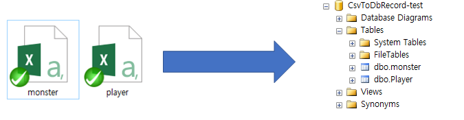

Move your CSV documents to your DB tables easily.


# How to use

Prepare your CSV files. For example, 
```
test/
  player.csv
  monster.csv
```
Prepare your tables. For example,
```
  player { Name, Score, Passcode }
  monster { NameX, ScoreX, PassCodeX } 
```

NOTE: You may use any field type.

Prepare your config file `csv-to-db-config.yaml`. For example,
```
Server: ".\\"
User-ID: ""
Password: ""
Database:	"CsvToDbRecord-test" # 레코드가 들어갈 DB의 데이터베이스 이름 
CSV-Filter: "*.csv" # 행들을 읽을 CSV 파일 검색 필터
```

Copy CsvToDbRecord.exe to the same folder and run it.
The work result will be printed on your console window.
